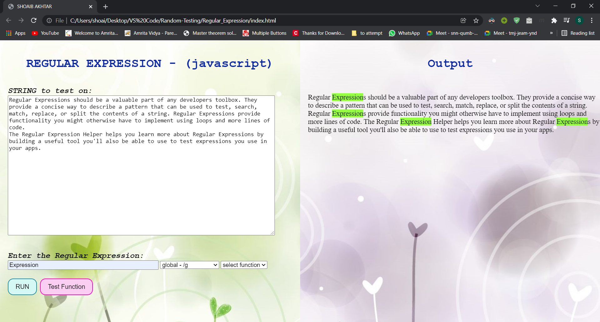
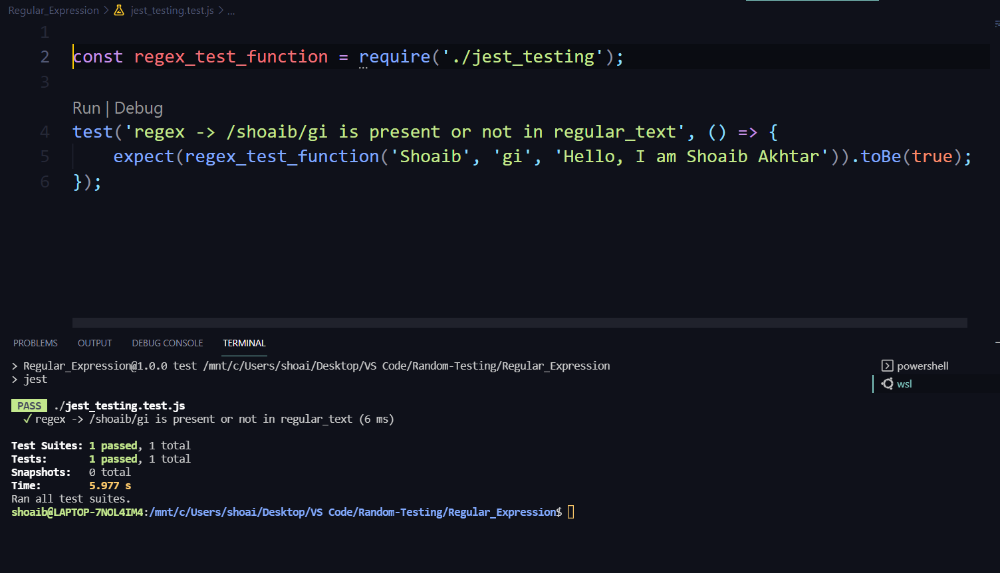

# Regular Expression (RegEx) in JAVASCRIPT
 

## I have Completed all the task including BONUS task.

### ***"index.html"*** is the main page which is linked with ***"script.js"***. By default some text is provided to the ***"String to test on"*** textbox.

- ### User can **enter** there own string to check upon

- ### index.html contains two drop down menu i.e "select flag" and "select function"
 

### If user want to check REGULAR EXPRESSION by clicking on ***RUN*** button the validation is as follows:-

- ### *'String to text on field'* is **mandatory**
- ### *'Enter the Regular Expression'* field is **mandatory**
- ### Selecting a flag is **mandatory** (user can also choose 'no flag')

 

### If user want to run a REGULAR EXPRESSION FUNCTION by clicking on ***TEST FUNCTION*** button the validation is as follows:-

- ### String to text on field is **mandatory**
- ### Enter the Regular Expression field is **mandatory**
- ### Selecting a function from the drop-down menu is **mandatory**
- ### Selecting a flag is ***OPTIONAL*** (user can select any flag if they want)

 

## All the BONUS FEATURES have been included:-

-  ### users can select flag (eg. - **['/g', '/i', '/m']**)
-  ### users can select Regex Function (**eg:- test(), search() or match()**)
-  ### users can see the **output** of the selected Regex Function
-  ### **Automation Demo** is also shown in the image ***'jest_output.png'***
 

## Main Page Output

 

## Jest Output (Last sub-task of BONUS task)

